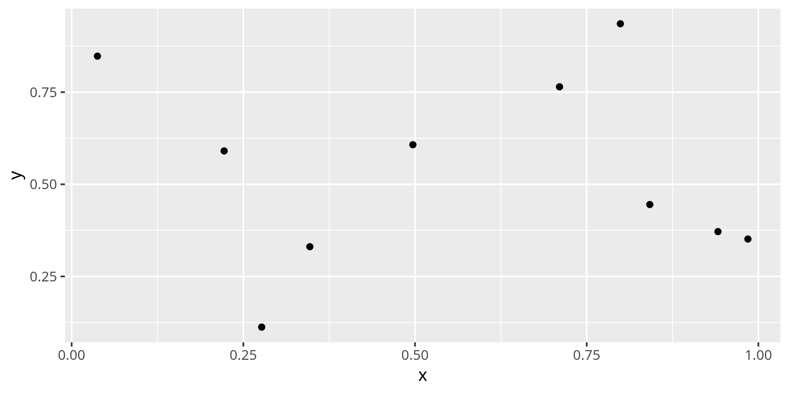

+++
title = "Insert title"

date = 2019-01-01
lastmod = 2019-01-01
draft = false

tags = ["tag"]
summary = "Insert summary"
abstract = "Insert summary"
authors = ["Vassilis Kehayas"]
hasPlotly = false
doi = ""
sourceFile = "src/post-template.Rmd"

+++


Insert text

Insert figure


```r
library(ggplot2)

x = runif(10)
y = runif(10)

qplot(x, y)
```

<!-- -->
